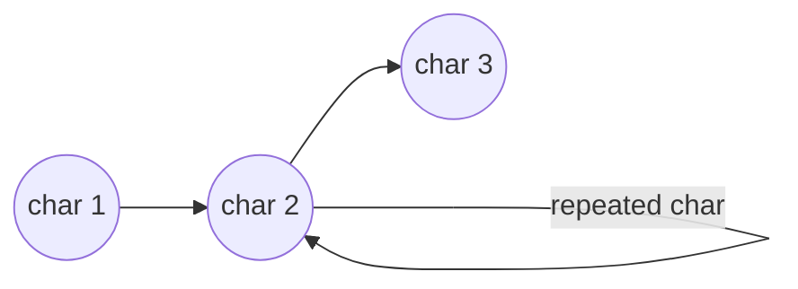

[TOC]

# 版权声明

- LeetCode 系列笔记来源于 LeetCode 题库[^1]，在个人思考的基础之上博采众长，受益匪浅；故今记此文，感怀于心，更多题解及程序，参见 Github[^2]；
- 该系列笔记不以盈利为目的，仅用于个人学习、课后复习及交流讨论；
- 如有侵权，请与本人联系（hqpan@foxmail.com），经核实后即刻删除；
- 本文采用 [署名-非商业性使用-禁止演绎 4.0 国际 (CC BY-NC-ND 4.0)](https://creativecommons.org/licenses/by-nc-nd/4.0/deed.zh) 协议发布；

# 1. LeetCode 10 & 剑指 Offer 19

- 递归：证明过程参见[^1]；

  - 时间复杂度：$2^{n+\frac{m}{2}}(n+m)$；

  - 空间复杂度：$2^{n+\frac{m}{2}}(n+m)$；

- 动态规划：

  - 时间复杂度：$O(nm)$；
  - 空间复杂度：$O(nm)$；

- 相同问题：剑指 Offer 19；

# 2. 递归

- 解题思路：
  - 若不考虑`*`，则字符串匹配仅有2种可能：
    - pattern 为普通字符，text 与 pattern 相同；
    - pattern 为`.`，text 为普通字符；
      - 注意在编程过程中限制 text 尚有字符待匹配（未结束），否则匹配仍失败；
      - `indexS != s.length()) && (p.charAt(indexP) == '.' || s.charAt(indexS) == p.charAt(indexP)`，一定要限制 text 仍有字符；
  - 若考虑`*`，则当前字符的匹配次数可能为0次、1次…… 将匹配过程用有限状态机表示如下：



- 代码解读：
  - indexS、indexP 和字符串长度的关系共有4种可能：
    - indexS == s.length()， indexP == p.length()：匹配成功；
    - indexS ！= s.length()， indexP == p.length()：匹配失败；
    - indexS == s.length()， indexP != p.length()：需进一步检测，E.g. 若 pattern 中剩余的字符串为`a*`，则可以出现0次，仍能完成匹配；
    - indexS != s.length()， indexP != p.length()：需进一步检测；
  - 若当前字符的后续字符为`*`，则当前字符可出现0次、1次等，通过递归调用实现；
  - 若当前字符的后续字符不为`*`，则再不考虑`*`的情况下进行字符匹配；
  - 对当前字符检测完成后，通过递归调用检测后续字符；

```java
// Approach 1: Recursion
class Solution {
    private String s;
    private String p;
    public boolean isMatch(String s, String p) {
        if (s == null || p == null)
            return false;
        this.s = s;
        this.p = p;
        return match(0, 0);
    }

    public boolean match(int indexS, int indexP) {        
        if (indexS == s.length() && indexP == p.length())
            return true;
        if (indexS != s.length() && indexP == p.length())
            return false;
        boolean currChar = (indexS != s.length()) && (p.charAt(indexP) == '.' || s.charAt(indexS) == p.charAt(indexP));
        if (indexP + 1 < p.length() && p.charAt(indexP + 1) == '*')
            return match(indexS, indexP + 2) || (currChar && match(indexS + 1, indexP));
        return currChar && match(indexS + 1, indexP + 1);
    }
}
```

# 3. 动态规划==unsolved==

- 求解过程中存在子结构复用；

# 4. Summary

## 4.1 Java 语法

- 字符串、数组长度：即`length()`和`length`；
  - 对于字符串：在`java.lang.string`中，提供`public int length()`返回字符串长度；
  - 对于数组，具有`length`属性值；

## 4.2 算法设计

- 引入有限状态机，分析字符串匹配过程中的状态变化；

# References

[^1]: https://leetcode-cn.com/u/hqpan/.
[^2]: https://github.com/hqpan/LeetCode.