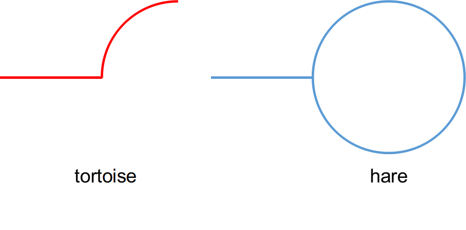

[TOC]

# 1. LeetCode 287

- 龟兔赛跑算法(Tortoise and Hare Algorithm)，又称 Floyd 判圈算法(Floyd Cycle Detection Algorithm) [1]；

# 2. 龟兔赛跑算法

- 针对本题分析有如下结论：

  - 数组`nums[n]`中有 n+1 个元素，各个元素的值均在 1-n 之间；
    - 故可将`nums[n]`视为下一个待访问数组元素的索引；
    - `nums[0]`不处于循环中；
  - 在上述限制条件下，必有循环存在；

- 龟兔赛跑算法：

  - 检测是否存在循环：
    - 选取起始节点（本题中取`nums[0]`），构造两个指针 tortoise 和 hare，前者每次前进一步，后者每次前进两步；
      - 若两指针再次相遇，则表明从该起始节点出发，必将进入某个循环；
      - 若指针 hare 到达某个没有后继的节点时，两指针仍未相遇，则表明从该起始节点出发，不会进入某个循环；
  - 检测循环的起点：
    - 若检测到循环存在，则可知此时指针 tortoise 和 hare 指向同一节点，不妨将该节点记为 A；
    - 令某一指针指向起始节点，另一指针仍指向节点 A；
    - 令两指针每次各前进一步，两者相遇时指向的节点即为循环的起点；
    - 备注：起始节点与节点 A 的间距为循环长度的整数倍；
      - 当检测到循环存在时，指针 hare 的路径长度是指针 tortoise 的路径长度的2倍，故有此结论；
      - 示例路径如下：指针 hare 相较于 tortoise 多出的一倍路径均在循环中；

  

  - 检测循环的长度：（本题中无需求解）
    - 若检测到循环存在，则可知此时指针 tortoise 和 hare 指向同一节点 A；
    - 令某一指针保持不变，另一指针每次前进一步，并统计前进步数；
    - 当两指针再次相遇时的前进步数，即为循环的长度；
    - 循环的长度最小为一，即该元素指向自身；

# Reference
[1] https://zh.wikipedia.org/wiki/Floyd%E5%88%A4%E5%9C%88%E7%AE%97%E6%B3%95.