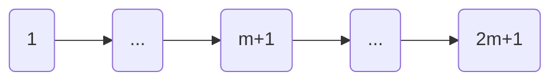
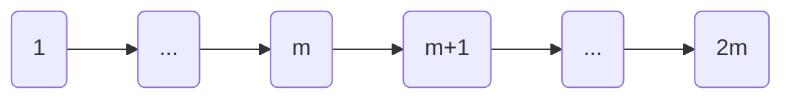

[TOC]

# 版权声明

- LeetCode 系列笔记来源于 LeetCode 题库[^1]，在个人思考的基础之上博采众长，受益匪浅；故今记此文，感怀于心，更多题解及程序，参见 Github[^2]；
- 该系列笔记不以盈利为目的，仅用于个人学习、课后复习及交流讨论；
- 如有侵权，请与本人联系（hqpan@foxmail.com），经核实后即刻删除；
- 本文采用 [署名-非商业性使用-禁止演绎 4.0 国际 (CC BY-NC-ND 4.0)](https://creativecommons.org/licenses/by-nc-nd/4.0/deed.zh) 协议发布；

# 1. LeetCode 295 & 剑指 Offer 41

## 1.1 复杂度分析

- 相似的问题：剑指 Offer 41；
- 若使用二叉搜索树，最坏情况下的时间复杂度：
  - 插入数据：$O(n)$；
  - 求解中位数：$O(n)$；

|    数据结构    | 插入数据  | 求解中位数 | 空间复杂度 |
| :------------: | :-------: | :--------: | :--------: |
|   未排序数组   |  $O(1)$   |   $O(n)$   |   $O(n)$   |
|    排序数组    |  $O(n)$   |   $O(1)$   |   $O(n)$   |
|    排序链表    |  $O(n)$   |   $O(1)$   |   $O(n)$   |
|   二叉搜索树   | $O(logn)$ | $O(logn)$  |   $O(n)$   |
| 最大堆、最小堆 | $O(logn)$ |   $O(1)$   |   $O(n)$   |

## 1.2 最大堆、最小堆

- 若数据流中的元素有奇数个，则中位数即为第$m+1$个值；



- 若数据流中的元素有偶数个，则中位数即为第$m$、$m+1$个值的均值；



- 解题思路：
  - 无需将所有元素排序，仅需维护与中值相关的2个元素即可；
  - 最大堆：保存数据流中较小的元素；
  - 最小堆：保存数据流中较大的元素；
- 难点：
  - 如何实现最大堆、最小堆中元素数量之差不大于1？
    - 若2个堆中已有元素数量相等，则将新元素添加至最大堆；
    - 否则，添加至最小堆；
  - 如何实现最大堆中的最大元素小于最小堆中的最小元素？
    - 如需将元素添加至最大堆：
      - 先将元素添加至最小堆；
      - 然后将最小堆中的最小元素取出，添加至最大堆；
    - 如需将元素添加至最小堆：
      - 先将元素添加至最大堆；
      - 然后将最大堆中的最大元素取出，添加至最小堆；

```java
class MedianFinder {
    private PriorityQueue<Integer> smaller;
    private PriorityQueue<Integer> larger;

    /** initialize your data structure here. */
    public MedianFinder() {
        smaller = new PriorityQueue<>((val1, val2) -> val2 - val1);
        larger = new PriorityQueue<>();
    }
    
    public void addNum(int num) {
        if (smaller.size() == larger.size()) {
            smaller.add(num);
            larger.add(smaller.poll());
        } else {
            larger.add(num);
            smaller.add(larger.poll());
        }
    }
    
    public double findMedian() {
        return smaller.size() != larger.size() ? larger.peek() : (smaller.peek() + larger.peek()) / 2.0;
    }
}
```

# 2. Summary

## 2.1 Grammar

- 整数相除结果仍为整数：参见本题中`findMedian()`函数；
  - `/2`：结果为整数；
  - `/2.0`：结果为小数；

## 2.2 算法设计

- 参见 LeetCode 295；

# References

[^1]: https://leetcode-cn.com/u/hqpan/.
[^2]: https://github.com/hqpan/LeetCode.