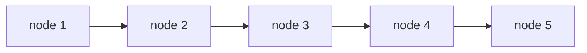
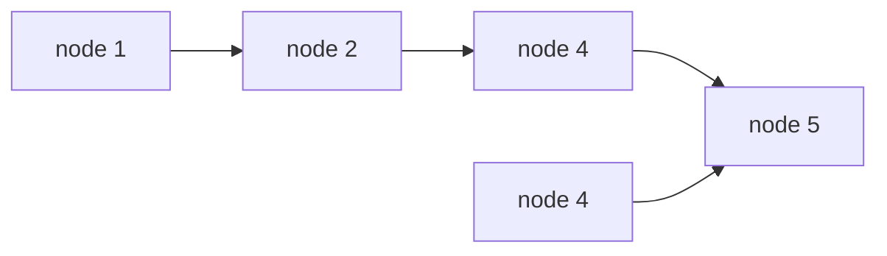

[TOC]

# 版权声明
- LeetCode 系列笔记来源于 LeetCode 题库[^1]，在个人思考的基础之上博采众长，受益匪浅；故今记此文，感怀于心，更多题解及程序，参见 Github[^2]；
- 该系列笔记不以盈利为目的，仅用于个人学习、课后复习及交流讨论；
- 如有侵权，请与本人联系（hqpan@foxmail.com），经核实后即刻删除；
- 本文采用 [署名-非商业性使用-禁止演绎 4.0 国际 (CC BY-NC-ND 4.0)](https://creativecommons.org/licenses/by-nc-nd/4.0/deed.zh) 协议发布；


# 1. 剑指 Offer 18
## 1.1 复杂度分析
- 考察内容：
  - 删除链表中特定节点；
  
  - 特殊测试用例：
    - 链表中无目标节点；
    - 链表中仅有1个节点，恰为目标节点；
    - 链表中有多个节点：
      - 目标节点为首节点；
      - 目标节点为尾节点；
- 双指针：
  - 时间复杂度：$O(n)$；
  - 空间复杂度：$O(1)$；
- 单指针：
  - 时间复杂度：$O(n)$；
  - 空间复杂度：$O(1)$；


## 1.2 双指针
- 解题思路：
  - 删除节点时，需记录当前节点和前驱节点；
  - 若检测到目标节点，则令前驱节点指向当前节点的后继节点，即可完成删除过程；
- 难点：对特殊测试用例的处理；

```java
// Approach 1: double pointer
class Solution {
    public ListNode deleteNode(ListNode head, int val) {
        if (head == null)
            return null;
        if (head.val == val)
            return head.next;
        ListNode pre = head;
        ListNode curr = head;
        while (curr != null) {
            if (curr.val == val) {
                pre.next = curr.next;
                return head;
            }
            pre = curr;
            curr = curr.next;
        }
        return head;
    }
}
```


## 1.3 单指针

- 解题思路：
  - 遍历链表，若检测到目标节点，则使用**后继节点的值**替换**当前节点的值**；
  - 令当前节点指向后继节点的后继节点，即可完成删除过程；
- 难点：
  - 对特殊测试用例的处理；
  - 若目标节点为尾节点，则需重新遍历链表，找出目标节点的前驱节点，方能完成删除操作；
- 节点删除前：



- 节点删除后：



```java
// Approach 2: single pointer
class Solution {
    public ListNode deleteNode(ListNode head, int val) {
        ListNode curr = head;
        if (head == null)
            return null;
        if (head.val == val && head.next != null)
            return head.next;
        while (curr != null) {
            if (curr.val == val && curr.next == null) {
                ListNode temp = head;
                while (temp.next != curr)
                    temp = temp.next;
                temp.next = null;
                return head;
            }                
            if (curr.val == val) {
                curr.val = curr.next.val;
                curr.next = curr.next.next;
                return head;
            }
            curr = curr.next;
        }
        return head;
    }
}
```


# References

[^1]: https://leetcode-cn.com/u/hqpan/.
[^2]: https://github.com/hqpan/LeetCode.