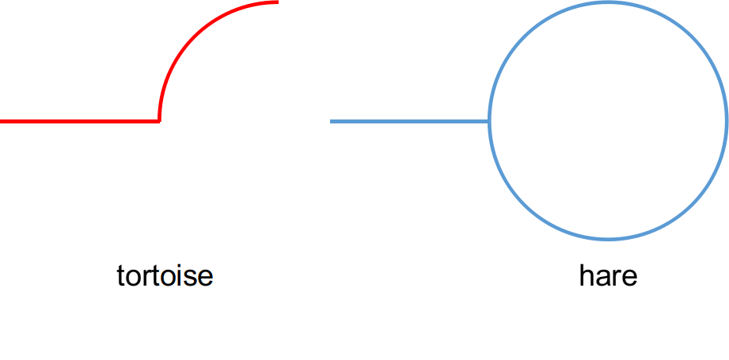

[TOC]


# 1. LeetCode 287 & 剑指 Offer 23

- 按下标将数组元素归位；若已知数组中所有元素的范围为 [1, n]，则从数组中第一个元素开始，将其放置到该值对应的索引位置上，若该值对应的索引位置上已有匹配的值，则该值即为重复值；
  - 时间复杂度：$O(n)$；
  - 空间复杂度：$O(n)$；
  - 缺点：需要事先已知所有元素的取值范围；
- 二分法：
  - 时间复杂度：$O(nlog(n))$；
  - 空间复杂度：$O(1)$；
- 龟兔赛跑算法(Tortoise and Hare Algorithm)，又称 Floyd 环检测算法(Floyd Cycle Detection Algorithm) [^1]；
  - 时间复杂度：$O(n)$；
  - 空间复杂度：$O(1)$；
- 相似的题：剑指 Offer 23，环检测问题；


# 2. 二分法

- 解题思路：
  - 已知数组中含有 n+1 个整数，且数值范围为 [1, n]，且仅有一个重复值；
  - 使用二分法，统计落入区间 [1, $\frac{n}{2}$] 中的整数个数；
  - 若该区间内的整数个数大于区间长度，则表明其中存在重复值；
  - 缩小区间范围，继续使用二分法，直至找出重复值；
- 缺点：
  - 需要事先已知所有元素的取值范围；
  - 不能找出所有重复值，E.g. 数组 [1, 1, 1, 4, 4]，无法检测出重复值4；
- 代码解读：
  - 由题意可知，数组中含有 n+1 个整数，且区间总长度为 n，仅需统计区间 [1, $\frac{n}{2}$] 或 [$\frac{n}{2}$, n]  中的整数个数，无需同时统计两个区间；
  - 此处不是对数组使用二分法，而是对数值的取值范围应用二分法，逐步缩小重复数的取值范围，最终检测到该值；

```java
// Approach 1: Binary search
class Solution {
    public int findDuplicate(int[] nums) {
        int length = nums.length;
        int lo = 1;
        int hi = length - 1;
        while (lo != hi)
        {
            int mid = (lo + hi) / 2;
            int count = 0;
            for (int i = 0; i < length; i++)
                if ((lo <= nums[i]) && (nums[i] <= mid))
                    count++;
            if (mid - lo + 1 < count)
                hi = mid;
            else
                lo = mid + 1;
        }
        return lo;
    }
}
```


# 3. 龟兔赛跑算法

- 针对本题分析有如下结论：

  - 数组`nums[n]`中有 n+1 个元素，各个元素的值均在 1-n 之间；
    - 故可将`nums[n]`视为下一个待访问数组元素的索引；
    - `nums[0]`不处于循环中，因为元素取值不为0；
  - 在上述限制条件下，必有循环存在；

- 龟兔赛跑算法：

  - 检测是否存在循环：
    - 选取起始节点（本题中取`nums[0]`），构造两个指针 tortoise 和 hare，前者每次前进一步，后者每次前进两步；
      - 若两指针再次相遇，则表明从该起始节点出发，必将进入某个循环；
      - 若指针 hare 到达某个没有后继的节点时，两指针仍未相遇，则表明从该起始节点出发，不会进入某个循环；
  - 检测循环的起点：
    - 若检测到循环存在，则可知此时指针 tortoise 和 hare 指向同一节点，不妨将该节点记为 A；
    - 令某一指针指向起始节点，另一指针仍指向节点 A；
    - 令两指针每次各前进一步，两者相遇时指向的节点即为循环的起点；
    - 备注：起始节点与节点 A 的间距为循环长度的整数倍；
      - 当检测到循环存在时，指针 hare 的路径长度是指针 tortoise 的路径长度的2倍，故有此结论；
      - 示例路径如下：指针 hare 相较于 tortoise 多出的一倍路径均在循环中；

  

  - 检测循环的长度：（本题中无需求解）
    - 若检测到循环存在，则可知此时指针 tortoise 和 hare 指向同一节点 A；
    - 令某一指针保持不变，另一指针每次前进一步，并统计前进步数；
    - 当两指针再次相遇时的前进步数，即为循环的长度；
    - 循环的长度最小为一，即该元素指向自身；
  
- 难点：将寻找重复数问题，抽象为环检测问题；

```java
// Approach 2: Floyd cycle detection algorithm
class Solution {
    public int findDuplicate(int[] nums) {
        // Find the intersection point of the two runners.
        int tortoise = nums[0];
        int hare = nums[0];
        do {
            tortoise = nums[tortoise];
            hare = nums[nums[hare]];
        } while (tortoise != hare);

        // Find the "entrance" to the cycle.
        int ptr1 = nums[0];
        int ptr2 = tortoise;
        while (ptr1 != ptr2) {
            ptr1 = nums[ptr1];
            ptr2 = nums[ptr2];
        }
        return ptr1;
    }
}
```


# 4. Summary

- 二分法：此处不是对数组使用二分法，而是对数值的取值范围应用二分法，逐步缩小重复数的取值范围，最终检测到该值；
- 环检测算法：
  - Step 1：检测是否有环；
    - 使用快慢指针，前者速度是后者的2倍；
    - 若环不存在，则快指针将到达尾节点，程序结束；
    - 若环存在，则快慢指针必将相遇；
      - 在环中，快慢指针的相对位置仅有2种可能；
      - 快指针、慢指针相差1步（相差奇数步），1次移动后即可相遇；
      - 快指针、慢指针相差2步（相差偶数步），2次移动后即可相遇；
  - Step 2：求解环中节点数量；
    - 令一个指针保持不动，另一个指针每次向前移动1步并计数；
    - 当两指针重合时，计数值即为环中节点数量；
  - Step 3：求解入环的起点；
    - 令快慢指针重新指向起点；
    - 令快指针向前移动 n 步，n 为环中节点数量；
    - 令快慢指针同时向前移动，每次移动一步，当两指针相遇时，相遇点即为入环起点；
    - 即快指针绕环一圈后，与慢指针在入环起点处相遇；


# Reference
[^1]: https://zh.wikipedia.org/wiki/Floyd%E5%88%A4%E5%9C%88%E7%AE%97%E6%B3%95.