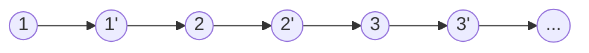

[TOC]

# 版权声明

- LeetCode 系列笔记来源于 LeetCode 题库[^1]，在个人思考的基础之上博采众长，受益匪浅；故今记此文，感怀于心，更多题解及程序，参见 Github[^2]；
- 该系列笔记不以盈利为目的，仅用于个人学习、课后复习及交流讨论；
- 如有侵权，请与本人联系（hqpan@foxmail.com），经核实后即刻删除；
- 本文采用 [署名-非商业性使用-禁止演绎 4.0 国际 (CC BY-NC-ND 4.0)](https://creativecommons.org/licenses/by-nc-nd/4.0/deed.zh) 协议发布；

# 1. LeetCode 138 & 剑指 Offer 35

## 1.1 复杂度分析

- 二重循环：
  - 时间复杂度：$O(n^2)$；
  - 空间复杂度：$O(n)$；
- 哈希表：
  - 时间复杂度：$O(n)$；
  - 空间复杂度：$O(n)$；
- 复制、拆分链表：
  - 时间复杂度：$O(n)$；
  - 空间复杂度：$O(n)$；
- 相关题型：
  - 相同的题：剑指 Offer 35；

## 1.2 二重循环
- 解题思路：
  - 考虑到复杂链表中的1个节点指向2个后继节点，因此先复制`next`，后复制`random`；
  - 第1次遍历链表：复制`next`；
  - 第2次遍历链表：复制`random`；
    - 为了确定每个节点的`random`指向的后继节点位置，需使用二重循环遍历链表；

```java
/*
// Definition for a Node.
class Node {
    int val;
    Node next;
    Node random;

    public Node(int val) {
        this.val = val;
        this.next = null;
        this.random = null;
    }
}
*/
// Approach 1: 二重循环
class Solution {
    public Node copyRandomList(Node head) {
        if (head == null)
            return head;
        Node res = new Node(head.val);
        Node currHead = head;
        Node currRes = res;
        while (currHead.next != null) {
            currRes.next = new Node(currHead.next.val);
            currHead = currHead.next;
            currRes = currRes.next;
        }
        currHead = head;
        currRes = res;
        while (currHead != null) {
            Node nodeHead = head;
            Node nodeRes = res;
            if (currHead.random == null)
                currRes.random = null;
            else {
                while (!nodeHead.equals(currHead.random)) {
                    nodeHead = nodeHead.next;
                    nodeRes = nodeRes.next;
                }
                currRes.random = nodeRes;
            }
            currHead = currHead.next;
            currRes = currRes.next;
        }
        return res;
    }
}
```

## 1.3 哈希表
- 解题思路：
  - 考虑到复杂链表中的1个节点指向2个后继节点，因此先复制`next`，后复制`random`；
  - 由于二重循环中，大量的时间开销用于检测`random`指向的后继节点位置，因此引入哈希表；
  - 第1次遍历链表：复制`next`；
    - 哈希表中的键：原始链表中的节点；
    - 哈希表中的值：新链表中的节点；
  - 第2次遍历链表：复制`random`；
    - 借助哈希表，可在常数时间开销内，找出`random`指向的后继节点位置；

```java
// Approach 2: 哈希表
class Solution {
    public Node copyRandomList(Node head) {
        if (head == null)
            return head;
        Node res = new Node(head.val);
        Node currHead = head;
        Node currRes = res;
        HashMap<Node, Node> st = new HashMap<>();
        while (currHead.next != null) {
            currRes.next = new Node(currHead.next.val);
            st.put(currHead, currRes);
            currHead = currHead.next;
            currRes = currRes.next;
        }
        st.put(currHead,currRes);
        currHead = head;
        currRes = res;
        while (currHead != null) {
            currRes.random = st.get(currHead.random);
            currHead = currHead.next;
            currRes = currRes.next;
        }
        return res;
    }
}
```

## 1.4 复制、拆分链表

- 解题思路：
  - 考虑到复杂链表中的1个节点指向2个后继节点，因此先复制`next`，后复制`random`；
  - 考虑到构建哈希表，需要使用线性空间开销；
  - 为减小空间开销，分3步完成复杂链表复制：
    - 复制`next`：在原始链表中，为每个节点创建复制节点，插入原始链表中，如下图所示；
    - 复制`random`：遍历链表，复制`random`；
    - 拆分链表；



- 源程序：

```java
// Approach 3: 复制、拆分链表
class Solution {
    public Node copyRandomList(Node head) {
        if (head == null)
            return head;
        copy(head);
        link(head);
        return split(head);
    }

    public void copy(Node head) {
        Node curr = head;
        while (curr != null) {
            Node temp = curr.next;
            curr.next = new Node(curr.val);
            curr.next.next = temp;
            curr = curr.next.next;
        }
    }

    public void link(Node head) {
        Node curr = head;
        while (curr != null) {
            curr.next.random = curr.random == null ? null : curr.random.next;
            curr = curr.next.next;
        }
    }

    public Node split(Node head) {
        Node res = head.next;
        Node currHead = head;
        Node currRes = res;
        while (currRes.next != null) {
            currHead.next = currHead.next.next;
            currRes.next = currRes.next.next;
            currHead = currHead.next;
            currRes = currRes.next;
        }
        currHead.next = null;
        currRes.next = null;
        return res;
    }
}
```

# 2. Summary

- 参见 LeetCode 138 解题思路；

# References

[^1]: https://leetcode-cn.com/u/hqpan/.
[^2]: https://github.com/hqpan/LeetCode.