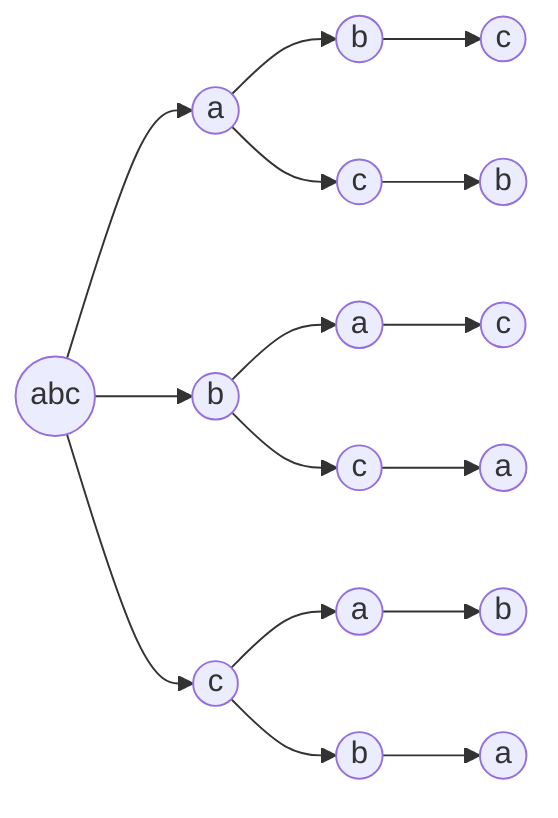

[TOC]

# 版权声明

- LeetCode 系列笔记来源于 LeetCode 题库[^1]，在个人思考的基础之上博采众长，受益匪浅；故今记此文，感怀于心，更多题解及程序，参见 Github[^2]；
- 该系列笔记不以盈利为目的，仅用于个人学习、课后复习及交流讨论；
- 如有侵权，请与本人联系（hqpan@foxmail.com），经核实后即刻删除；
- 本文采用 [署名-非商业性使用-禁止演绎 4.0 国际 (CC BY-NC-ND 4.0)](https://creativecommons.org/licenses/by-nc-nd/4.0/deed.zh) 协议发布；

# 1. 剑指 Offer 38

## 1.1 复杂度分析

- DFS：
  - 时间复杂度：$O(n!)$；
  - 空间复杂度：$O(n^2)$；
- 相似的问题：
  - 将8个数字放置到正方体的8个顶点上，使得正方体上3组相对的面；
  - 8皇后问题；
  - 注意：若题目要求按特定规则摆放数字，则先求解所有数字可能的排列结果，然后筛选出满足要求的结果；

## 1.2 DFS
- 解题思路：
  - 数学中的排列问题：求解全排列的结果；
    - 若参与全排列的元素各不相同，则共有$n!$种排列方式；
    - 若参与全排列的元素中存在相同元素，则使用集合记录排列中已使用的元素，完成去重操作；
    - 对于每个位置，使用位于**当前位置之后的**不同的元素放置于此处，迭代放置各个位置上的元素即可；
- E.g. “abc”的全排列：




- 源程序：

```java
class Solution {
    List<String> res = new LinkedList<>();
    char[] chars;
    public String[] permutation(String s) {
        chars = s.toCharArray();
        dfs(0);
        return res.toArray(new String[res.size()]);
    }

    public void dfs(int index) {
        if (index == chars.length - 1) {
            res.add(String.valueOf(chars));
            return;
        }
        HashSet<Character> set = new HashSet<>();
        for (int i = index; i < chars.length; i++) {
            if (set.contains(chars[i]))
                continue;
            set.add(chars[i]);
            swap(index, i);
            dfs(index + 1);
            swap(i, index);
        }
    }

    public void swap(int index1, int index2) {
        char temp = chars[index1];
        chars[index1] = chars[index2];
        chars[index2] = temp;
    }
}
```

# 2. Summary

- 参见剑指 Offer 38 解题思路；

# References

[^1]: https://leetcode-cn.com/u/hqpan/.
[^2]: https://github.com/hqpan/LeetCode.